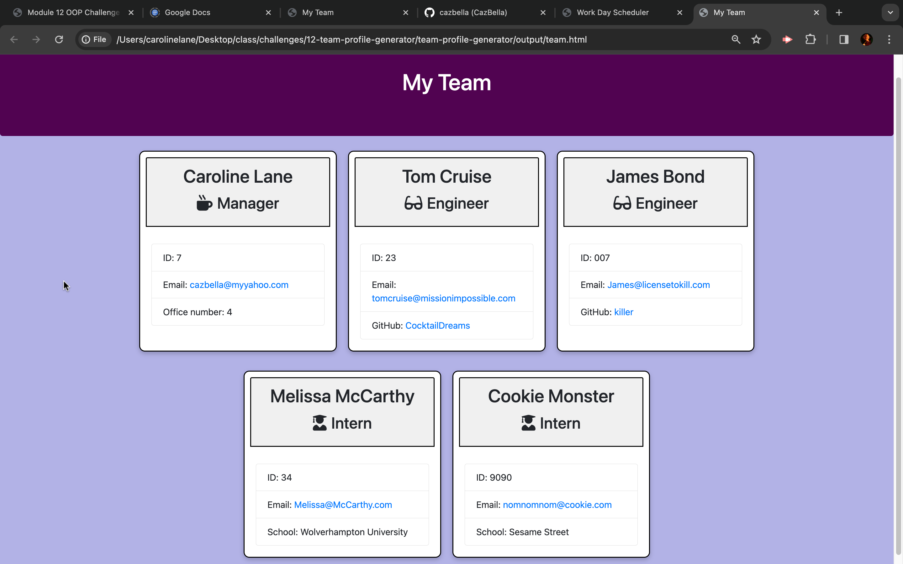

# Team Profile Generator

### Contact Information
- **GitHub:** [Cazbella](https://github.com/Cazbella)
- **Email:** cazbella@myyahoo.com

## Table of Contents
- [Description](#description)
- [Installation](#installation)
- [Usage](#usage)
- [Contributing](#contributing)
- [Tests](#tests)
- [License](#license)
- [Example HTML](#example)
- [Questions](#questions)
- [Additional References](#additional-references)

## Description
The Team Profile Generator is a command-line application that allows users to generate a simple HTML webpage displaying their team's information. The application prompts the user to enter details for various team members, including managers, engineers, and interns. It then generates an HTML file that visually represents the team hierarchy and individual profiles for each team member.

The generated HTML includes cards for each team member, providing essential information such as their name, role, ID, email, and role-specific details (e.g., office number for managers, GitHub username for engineers, and school for interns). The application is designed to be user-friendly, allowing users to efficiently create and showcase their team's details.

## Installation
To install and use the Team Profile Generator, follow these steps: Make sure you have Node.js installed on your machine. Clone the project repository from GitHub to your local environment. Open your terminal and navigate to the project directory. Run the command npm install to install the necessary dependencies. Once the installation is complete, you're ready to use the application. Simply run the tool using the command node index.js and follow the prompts to generate a the team cards. Any further customisation of the cards should take place in the generated HTML file.

## Usage
Run the application by adding 'node index.js' in the terminal. 
1. Follow the prompts to enter details for each team member.
2. Once all team members are added, choose the option to finish and generate the HTML.
3. Find the generated HTML file in the "output" directory.
4. The generated HTML file should look similar to the screenshot below. 

## Contributing
Contributions to this project are welcome and encouraged! If you have ideas for new features, find a bug, or want to improve the documentation, feel free to contribute. To contribute to the project fork the repository on GitHub. Clone your forked repository to your local machine. Create a new branch with a descriptive name for your contribution: git checkout -b feature/new-feature or git checkout -b bug/fix-bug. Then make your changes and commit them with a clear message. Push your changes to your forked repository and open a pull request in the main repository with a detailed description of your changes. Please follow the project's coding style and adhere to the existing conventions. By contributing, you agree that your contributions will be licensed under the project's license. Thank you for helping make my Professional Readme better!

## Tests
Testing my application is a step you can carry out to ensure its functionality and reliability. The application files contain tests that can be accessed with the correct dependencies using 'npm test' in the command line. For users who would like to carry out their own tests, follow these simple steps: make sure you have Node.js installed on your machine, clone the project repository to your local environment if you haven't already, open your terminal and navigate to the project directory, and run the command npm test to execute the test suite. The testing process will provide valuable insights into the stability of the application and help maintain a robust codebase. If you encounter any issues during the testing process, please refer to the project's documentation or reach out for assistance.

## License 
MIT License

## Example HTML file
Please find a link to a HTML file generated by the application here

## Questions
If you have any questions or need further assistance with this project, feel free to reach out. Common questions might include clarification on the installation process, guidance on using specific features, or troubleshooting any issues you may encounter. I value your feedback! You can contact me via email at cazbella@myyahoo.com. Please don't hesitate to ask!

## Additional References

https://www.educative.io/answers/how-to-use-the-inquirer-node-package

https://stackoverflow.com/questions/57321266/how-to-test-inquirer-validation
